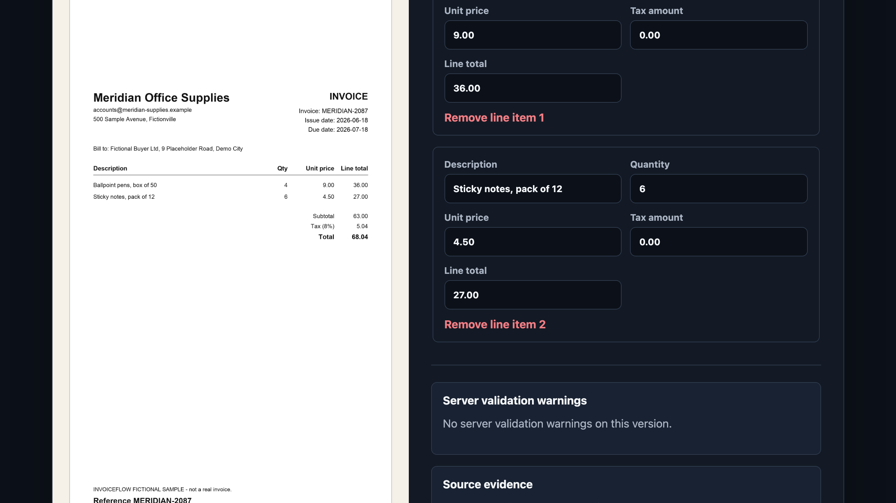

<div align="center">

# InvoiceFlow

**Turn an invoice into clean, reviewed data — with a human in control.**
**Превращает счёт в чистые проверенные данные — под контролем человека.**

[](https://go.dev)
[](https://www.postgresql.org)
[](https://react.dev)
[](https://www.docker.com)
[](LICENSE)
[](#-honest-limitations--честные-ограничения)



<sub>The review screen — the original document on the left, editable extracted values on the right.</sub>

</div>

---

<div align="center">

### 🌐 Choose your language & track · Выберите язык и уровень

| | 👤 For everyone · Простыми словами | 🛠 For engineers · Для инженеров |
|---|---|---|
| 🇬🇧 **English** | [Read →](#-english--for-everyone) | [Read →](#-english--for-engineers) |
| 🇷🇺 **Русский** | [Читать →](#-русский--простыми-словами) | [Читать →](#-русский--для-инженеров) |

</div>

> **Status / Статус:** a working end-to-end demo, not a released product. Stages 0–7 are complete. The default demo runs fully offline with no API keys. · Рабочее демо от начала до конца, а не готовый продукт. Этапы 0–7 завершены. Демо по умолчанию работает полностью офлайн, без API-ключей.

---

## 🇬🇧 English · For everyone

### What it is

Invoice data usually arrives as a PDF or a photo and gets **retyped by hand** into spreadsheets and accounting tools. That is slow, and typos in money are expensive. Fully automatic AI extraction is risky too — financial documents vary, and a confident wrong number is worse than no number.

**InvoiceFlow keeps the speed *and* the control.** It reads an invoice, proposes the values, and then hands them to a person to check. Nothing leaves the system until someone approves it.

### How it feels to use

1. **📤 Upload** an invoice — PDF, JPEG, or PNG.
2. **🔎 It reads the document** and fills in supplier, dates, amounts, tax, and line items.
3. **👀 You review** the original side-by-side with the extracted values. The system highlights anything it *couldn't* verify — for example, when "subtotal + tax" doesn't equal the total.
4. **✏️ You correct** anything that's wrong. Every edit is saved as a new version — the old one is never overwritten.
5. **✅ You approve** one exact version. Only then can it be exported.
6. **📦 You export** the approved data to a CSV file or send it to another system.

### What it deliberately does *not* do

- ❌ It **never pays** an invoice and **never connects to a bank**.
- ❌ It is **not an accounting system** — no bookkeeping, no tax filing.
- ❌ The AI **cannot approve or export on its own**. A person always has the final say.

### Try it in one command

You need [Docker](https://www.docker.com/). No API keys, no sign-up, no internet call to any AI provider.

```bash
docker compose up --build --wait
```

Then open **<http://127.0.0.1:8080>** and upload one of the sample invoices from the `testdata/` folder. Every sample is completely made up — no real company or person.

👉 Engineer and want the details? Jump to **[For engineers →](#-english--for-engineers)**.

---

## 🇬🇧 English · For engineers

A **Go modular monolith** (separate `api` and `worker` binaries) over **PostgreSQL**, with a **React + TypeScript (Vite)** front end. Uploaded files, extracted text, OCR output, and model output are all treated as **untrusted input** — none of them can set a document state, storage key, actor, approval, or export target.

### Architecture at a glance

```text
React + Vite (web/)              Go API (cmd/api)
  /      product story             GET  /healthz, /readyz
  /app   upload + split review     POST /api/v1/documents
                                   GET  /api/v1/documents/{id}
                                        …review, approve, export
                                          |
              validate → SHA-256 → private temp file → promote
                                          |
        one transaction: stored object + document + audit event + job
                                          |
                               Go worker (cmd/worker)
        claim lease → bounded PDF text → OCR fallback → strict proposal
              → normalize + warn → immutable version → needs_review
```

Document states: `uploaded` → `queued` → `processing` → `needs_review` → `approved` → `exported`, plus `rejected` and `failed`. Invalid transitions return a stable, machine-readable error.

### Design decisions worth reading the code for

- **Durable work, not an in-memory queue.** Processing and export are PostgreSQL jobs with lease tokens, recorded attempts, expired-lease recovery, bounded retries, and dead-letter states. Restarting a worker never loses queued work. Jobs are claimed with `FOR UPDATE SKIP LOCKED`.
- **Exact money.** Amounts are integer minor units with an explicit currency, under a named rounding policy (`money-v1`) stored on every snapshot. No binary floating point ever touches an amount; aggregation cannot silently wrap `int64`.
- **Immutability by construction.** Invoice versions and audit events reject `UPDATE`/`DELETE` at the database level. A correction writes a *new* version; approval targets one exact version number; export reads only the approved foreign key and is idempotent (byte-identical CSV on every repeat).
- **The model is behind a boundary.** The structured extractor sits behind an `Extractor` interface. The default is offline and deterministic: a fixture registry answers first, and a regex reader runs only when no fixture matched, so an unseen invoice still produces real candidates instead of an empty form. Provider output is decoded as strict JSON with unknown fields rejected, then fully re-validated and normalized server-side. It cannot control identity, storage, status, approval, or secrets.
- **Evidence is proven, never asserted.** An adapter may attach a source page and excerpt; the server persists it only after checking the excerpt literally occurs in that page's bounded text. The offline reader quotes the exact line it read each value from, so the review screen shows provenance that was verified rather than claimed.
- **Hardened I/O.** Extraction tools (Poppler, Tesseract) are invoked as fixed absolute paths with literal argument arrays, under process timeouts and output caps — no filename is ever interpolated into a shell string. The static web bundle is served from memory by exact key lookup, so path traversal and symlink escape are *structurally* impossible, and every response carries a fixed first-party CSP with no `unsafe-inline`/`unsafe-eval`.
- **Safe webhooks.** Destinations and secrets are process configuration, never request data. Strict mode is HTTPS-only, redirect-free, port 443, rejects private/reserved addresses with DNS-answer validation, and signs canonical bytes with HMAC-SHA256. Delivery is at-least-once; receivers deduplicate by idempotency key.

### Commands

```bash
make fmt              # gofmt
make lint             # go vet
make test             # Go unit tests
make test-integration # PostgreSQL integration tests, needs DATABASE_URL
make frontend-test    # typecheck, Vitest, production build
make build            # both binaries + the web bundle
make smoke-compose    # full Compose smoke: upload → … → export → audit
# frontend-test also runs Prettier --check and ESLint before the build.
```

Local dev without Docker: a reachable PostgreSQL, then `go run ./cmd/api`, `go run ./cmd/worker`, and `npm run dev` in `web/` (Vite proxies `/api`). Configuration is environment-only — see [`.env.example`](.env.example). `WEB_DIR` is optional; empty means the API serves JSON only.

### Testing

- **Go unit:** validation, hashing/duplicates, state transitions, money & date normalization, schema validation, arithmetic warnings, retry classification, webhook signatures, export idempotency, static delivery.
- **PostgreSQL integration:** migrations and their guard rails, the atomic intake transaction, concurrent duplicate handling, single-winner job claims, lease recovery, immutable versions, orphan reconciliation, export retry/dead-lettering, and the composite foreign keys binding an export to its exact approved version.
- **Frontend:** upload states, extracted/warning/edit presentation, line-item editing, approval confirmation, export lifecycle, reduced motion, accessible labels, and an axe pass.
- **Compose smoke:** start → readiness → upload → processing → review → correction → approval → idempotent CSV → signed webhook → audit → rejection.

CI runs the Go, integration, and frontend suites on every push and pull request.

### Documentation

[`docs/ARCHITECTURE.md`](docs/ARCHITECTURE.md) · [`docs/API_CONTRACT.md`](docs/API_CONTRACT.md) · [`docs/SECURITY_MODEL.md`](docs/SECURITY_MODEL.md) · [`docs/DECISIONS.md`](docs/DECISIONS.md) (ADR log) · [`docs/DEMO_SCRIPT.md`](docs/DEMO_SCRIPT.md) · [`docs/DEPLOYMENT.md`](docs/DEPLOYMENT.md)

---

## 🇷🇺 Русский · Простыми словами

### Что это

Данные из счетов обычно приходят в виде PDF или фотографии, и их **вручную перепечатывают** в таблицы и бухгалтерские программы. Это медленно, а ошибка в сумме стоит дорого. Полностью автоматическое извлечение через ИИ тоже рискованно — финансовые документы очень разные, а уверенно названное неверное число хуже, чем отсутствие числа.

**InvoiceFlow сохраняет и скорость, и контроль.** Он читает счёт, предлагает значения и передаёт их человеку на проверку. Ничего не покидает систему, пока человек не подтвердит.

### Как это ощущается в работе

1. **📤 Загружаете** счёт — PDF, JPEG или PNG.
2. **🔎 Система читает документ** и заполняет поставщика, даты, суммы, налог и позиции.
3. **👀 Вы проверяете** оригинал рядом с извлечёнными значениями. Система подсвечивает всё, что **не смогла** проверить — например, когда «подытог + налог» не равен итогу.
4. **✏️ Вы исправляете** ошибки. Каждая правка сохраняется как новая версия — старая никогда не перезаписывается.
5. **✅ Вы утверждаете** одну конкретную версию. Только после этого возможен экспорт.
6. **📦 Вы экспортируете** утверждённые данные в CSV или отправляете в другую систему.

### Чего он сознательно **не** делает

- ❌ **Никогда не оплачивает** счёт и **не подключается к банку**.
- ❌ Это **не бухгалтерская система** — нет учёта и сдачи налогов.
- ❌ ИИ **не может сам утвердить или экспортировать**. Последнее слово всегда за человеком.

### Попробовать одной командой

Нужен [Docker](https://www.docker.com/). Без API-ключей, без регистрации, без обращений к какому-либо ИИ-провайдеру в интернете.

```bash
docker compose up --build --wait
```

Затем откройте **<http://127.0.0.1:8080>** и загрузите один из образцов счетов из папки `testdata/`. Все образцы полностью вымышлены — ни одной реальной компании или человека.

👉 Вы инженер и хотите деталей? Переходите к разделу **[Для инженеров →](#-русский--для-инженеров)**.

---

## 🇷🇺 Русский · Для инженеров

**Модульный монолит на Go** (отдельные бинарники `api` и `worker`) поверх **PostgreSQL**, с фронтендом на **React + TypeScript (Vite)**. Загруженные файлы, извлечённый текст, вывод OCR и вывод модели считаются **недоверенными данными** — ничто из этого не может задать состояние документа, ключ хранилища, актора, утверждение или цель экспорта.

### Архитектура вкратце

```text
React + Vite (web/)              Go API (cmd/api)
  /      витрина продукта          GET  /healthz, /readyz
  /app   загрузка + ревью          POST /api/v1/documents
                                   GET  /api/v1/documents/{id}
                                        …ревью, утверждение, экспорт
                                          |
             валидация → SHA-256 → приватный temp-файл → promote
                                          |
      одна транзакция: объект + документ + событие аудита + задача
                                          |
                               Go worker (cmd/worker)
        захват lease → текст PDF в границах → OCR → строгое предложение
              → нормализация + предупреждения → неизменяемая версия
```

Состояния документа: `uploaded` → `queued` → `processing` → `needs_review` → `approved` → `exported`, плюс `rejected` и `failed`. Недопустимые переходы возвращают стабильную машиночитаемую ошибку.

### Решения, ради которых стоит заглянуть в код

- **Надёжная очередь, а не in-memory.** Обработка и экспорт — это задачи в PostgreSQL с lease-токенами, учётом попыток, восстановлением просроченных lease, ограниченными ретраями и dead-letter состояниями. Перезапуск воркера не теряет работу. Задачи захватываются через `FOR UPDATE SKIP LOCKED`.
- **Точные деньги.** Суммы — целые минорные единицы с явной валютой, под именованной политикой округления (`money-v1`), сохранённой в каждом снимке. Никакой двоичной плавающей точки; агрегация не может тихо переполнить `int64`.
- **Неизменяемость по построению.** Версии счёта и события аудита отклоняют `UPDATE`/`DELETE` на уровне БД. Правка создаёт **новую** версию; утверждение указывает на один точный номер версии; экспорт читает только утверждённый внешний ключ и идемпотентен (побайтово идентичный CSV при повторах).
- **Модель за границей.** Структурированный экстрактор скрыт за интерфейсом `Extractor`. По умолчанию путь офлайновый и детерминированный: сначала отвечает реестр фикстур, а regex-ридер запускается только если ни одна фикстура не совпала — поэтому незнакомый счёт даёт реальные кандидаты, а не пустую форму. Вывод провайдера декодируется как строгий JSON с отклонением неизвестных полей, затем полностью перепроверяется и нормализуется на сервере. Он не управляет идентичностью, хранилищем, статусом, утверждением или секретами.
- **Доказательства проверяются, а не декларируются.** Адаптер может приложить страницу и цитату источника; сервер сохранит их только после проверки, что цитата буквально встречается в тексте этой страницы. Офлайн-ридер цитирует ту самую строку, из которой прочитал значение, — на экране ревью видно проверенное происхождение, а не заявленное.
- **Защищённый ввод-вывод.** Инструменты извлечения (Poppler, Tesseract) вызываются по фиксированным абсолютным путям с литеральными массивами аргументов, под таймаутами и лимитами вывода — имя файла никогда не попадает в shell-строку. Статический бандл отдаётся из памяти по точному ключу, поэтому обход путей и symlink-escape **структурно невозможны**, а каждый ответ несёт фиксированный CSP без `unsafe-inline`/`unsafe-eval`.
- **Безопасные вебхуки.** Адрес и секрет — это конфигурация процесса, а не данные запроса. Строгий режим: только HTTPS, без редиректов, порт 443, отклонение приватных/зарезервированных адресов с валидацией DNS-ответа, подпись канонических байтов через HMAC-SHA256. Доставка — at-least-once; получатель дедуплицирует по ключу идемпотентности.

### Команды

```bash
make fmt              # gofmt
make lint             # go vet
make test             # Go unit-тесты
make test-integration # интеграционные тесты PostgreSQL, нужен DATABASE_URL
make frontend-test    # typecheck, Vitest, прод-сборка
make build            # оба бинарника + веб-бандл
make smoke-compose    # полный smoke в Compose: upload → … → export → audit
# frontend-test также прогоняет Prettier --check и ESLint до сборки.
```

Локальная разработка без Docker: доступный PostgreSQL, затем `go run ./cmd/api`, `go run ./cmd/worker` и `npm run dev` в `web/` (Vite проксирует `/api`). Конфигурация — только через окружение, см. [`.env.example`](.env.example). `WEB_DIR` опционален; пустое значение — API отдаёт только JSON.

### Тестирование

- **Go unit:** валидация, хеширование/дубликаты, переходы состояний, нормализация денег и дат, валидация схемы, арифметические предупреждения, классификация ретраев, подписи вебхуков, идемпотентность экспорта, статическая отдача.
- **Интеграция PostgreSQL:** миграции и их защита, атомарная транзакция приёма, конкурентные дубликаты, единственный победитель при захвате задачи, восстановление lease, неизменяемые версии, сверка «сирот», ретраи/dead-letter экспорта и составные внешние ключи, связывающие экспорт с точной утверждённой версией.
- **Фронтенд:** состояния загрузки, показ извлечённого/предупреждений/правок, редактирование позиций, подтверждение утверждения, жизненный цикл экспорта, reduced motion, доступные подписи и прогон axe.
- **Compose smoke:** старт → готовность → загрузка → обработка → ревью → правка → утверждение → идемпотентный CSV → подписанный вебхук → аудит → отклонение.

CI гоняет Go, интеграционные и фронтенд-наборы на каждый push и pull request.

### Документация

[`docs/ARCHITECTURE.md`](docs/ARCHITECTURE.md) · [`docs/API_CONTRACT.md`](docs/API_CONTRACT.md) · [`docs/SECURITY_MODEL.md`](docs/SECURITY_MODEL.md) · [`docs/DECISIONS.md`](docs/DECISIONS.md) (журнал ADR) · [`docs/DEMO_SCRIPT.md`](docs/DEMO_SCRIPT.md) · [`docs/DEPLOYMENT.md`](docs/DEPLOYMENT.md)

---

## ⚖️ Honest limitations · Честные ограничения

These are current boundaries of the running system, not a roadmap. · Это текущие границы работающей системы, а не план.

| | English | Русский |
|---|---|---|
| **Payments** | No invoice payment or bank connectivity, by design. | Нет оплаты счетов и подключения к банку — принципиально. |
| **Accounting** | Not a bookkeeping/tax system; no compliance claim. | Не бухгалтерия и не налоги; никаких заявлений о соответствии. |
| **Auth** | One fixed server-side actor. No login, no multi-user authorization — including on a publicly reachable instance, where every visitor shares one workspace. A public deployment is opt-in configuration (ADR-016, [`docs/DEPLOYMENT.md`](docs/DEPLOYMENT.md)); this repository operates none and publishes no URL. | Один фиксированный актор. Нет входа и многопользовательской авторизации — в том числе на публичном стенде, где все посетители делят одно рабочее пространство. Публичное развёртывание — явная настройка (ADR-016, [`docs/DEPLOYMENT.md`](docs/DEPLOYMENT.md)); репозиторий не поддерживает ни одного стенда и не публикует URL. |
| **AI provider** | No model runs by default. The offline path is a fixture registry plus a regex reader that handles ordinary invoice layouts; both are deterministic, and neither is an accuracy claim. Unread fields stay empty rather than being guessed. | По умолчанию модель не вызывается. Офлайн-путь — реестр фикстур плюс regex-ридер для обычных раскладок счёта; оба детерминированы и не являются заявлением о точности. Непрочитанные поля остаются пустыми, а не угадываются. |
| **Heuristic limits** | The regex reader skips locale-ambiguous slash dates (`03/04/2026`), reads per-line tax as unknown rather than zero, and proposes a supplier name only when another field corroborates it. | Regex-ридер пропускает неоднозначные даты через слэш (`03/04/2026`), не считает построчный налог нулём и предлагает поставщика только при подтверждении другим полем. |
| **OCR** | JPEG/PNG go through Tesseract; raster OCR for scanned PDFs is intentionally not implemented. | JPEG/PNG идут через Tesseract; растровый OCR для сканированных PDF намеренно не реализован. |
| **Webhooks** | At-least-once delivery; "exactly once" is not claimed. | Доставка at-least-once; «ровно один раз» не заявляется. |
| **Scope** | No document list/search, no manual retry endpoint, no metrics endpoint. | Нет списка/поиска документов, ручного ретрая и эндпоинта метрик. |
| **Deployment** | Loopback demo; the Compose bootstrap role serves both migrations and runtime (not least-privilege). | Демо на loopback; роль bootstrap обслуживает и миграции, и рантайм (не least-privilege). |

No metric, customer, accuracy rate, or certification is asserted anywhere, because none has been measured. · Нигде не заявляются метрики, клиенты, точность или сертификация — потому что они не измерялись.

---

## 📄 License · Лицензия

[MIT](LICENSE) © 2026 Reinhold.
